# Hi, I'm Lihao 👋

**I build small tools that make daily life smoother — userscripts, web & desktop apps, and research code.**

热爱编程，喜欢探索新技术并解决各种问题。

[**Blog**](https://www.lgcyaxi.net) · [**Resume**](https://lgcyaxi.net/#/README?id=about-me) · [**Email**](mailto:leolihao@arizona.edu)

  

---

**Now:** 🔭 cooperative-driving & LiDAR research (`OpenCDA-MARL` · `XCalib`) · ⌨️ building `AhaKey Studio` in Rust/Tauri · ⚙️ shipping PyTorch-ROCm wheels for Windows · 🚚 moving Visualify to a new home

## 🚀 Featured Work

| Project | About | Status |
| :------ | :---- | :----: |
| [**AhaKey Studio**](https://github.com/lgcyaxi/AhakeyAI) | Rust/Tauri 2 client for the AhaKey X1 vibecoding keyboard — native BLE, local voice input, key profiles, plus experimental dual-BLE firmware ([merged upstream](https://github.com/AhakeyAI/desktop/pull/65)) | 🟢 Maintained |
| [**pytorch-rocm-rx6900xt-windows**](https://github.com/lgcyaxi/pytorch-rocm-rx6900xt-windows) | PyTorch-ROCm-on-Windows fork for the AMD Radeon RX 6900 XT (gfx1030) — prebuilt torch + torchvision wheels on [Releases](https://github.com/lgcyaxi/pytorch-rocm-rx6900xt-windows/releases) | 🟢 Maintained |
| [**Digit77 Helper**](https://greasyfork.org/zh-CN/scripts/495107-digit77-helper) | Userscript for digit77.com — auto-copies extraction codes, skips ad-link waits, auto-fills cloud-drive codes ([source](https://github.com/lgcyaxi/lgcyaxi/tree/main/projs/digit77helper)) | 🟢 Maintained |
| [**docsify-notes-combo**](https://github.com/lgcyaxi/lgcyaxi/tree/main/projs/docsify-plugins) | All-in-one note-taking plugin for Docsify — the toolkit behind my blog | 🚧 In development |
| [**Visualify.js**](https://github.com/visualify/visualify.js) | Data-visualization platform for the UArizona College of Pharmacy — frontend headed to GitHub Pages, heavy data stays on university servers | 🚚 Migrating |
| [**OpenCDA-MARL**](https://github.com/radar-lab/OpenCDA-MARL) | Unified benchmark for cooperative autonomous driving with multi-agent RL — extends OpenCDA under CARLA + SUMO co-simulation ([RA-L 2026](https://doi.org/10.1109/LRA.2026.3664656) · [docs](https://radar-lab.github.io/OpenCDA-MARL/)) | 🔬 Research |
| [**XCalib**](https://github.com/radar-lab/XCalib) | Camera–LiDAR cross-modal matching for edge devices — targetless calibration, pretrained matchers, ONNX/TensorRT export ([docs](https://radar-lab.github.io/XCalib/)) | 🔬 Research |
| **Roadside LiDAR Vehicle Detection** | Real-time vehicle detection on roadside LiDAR point clouds | 🔬 Research |
| [**Smart Home · ECE 513**](https://lgcyaxi.github.io/ECE513_IOT_Project/) | Full-stack IoT project — heart-rate devices, Node/Express API, live dashboard | ⚪ Completed |

Also in the drawer: [`tools/`](https://github.com/lgcyaxi/lgcyaxi/tree/main/tools) — pocket Python utilities (env checks, cache cleaning, tree dumps). More research at [radar-lab](https://github.com/radar-lab).

## 🧰 Toolbox

 

<picture>
  <source media="(prefers-color-scheme: dark)" srcset="https://raw.githubusercontent.com/lgcyaxi/lgcyaxi/main/profile/top-langs-dark.svg">
  
</picture>

## 📬 Elsewhere

- ✉️ leolihao@arizona.edu
- 📝 [Fluff & Stuff](https://www.lgcyaxi.net) — notes on code, courses, and whatever else sticks
- 🎮 🎧 📷 🥾 📚 🎬 — games · music · photography · hiking · reading · movies

---

感谢来访 · Thanks for stopping by 😄

